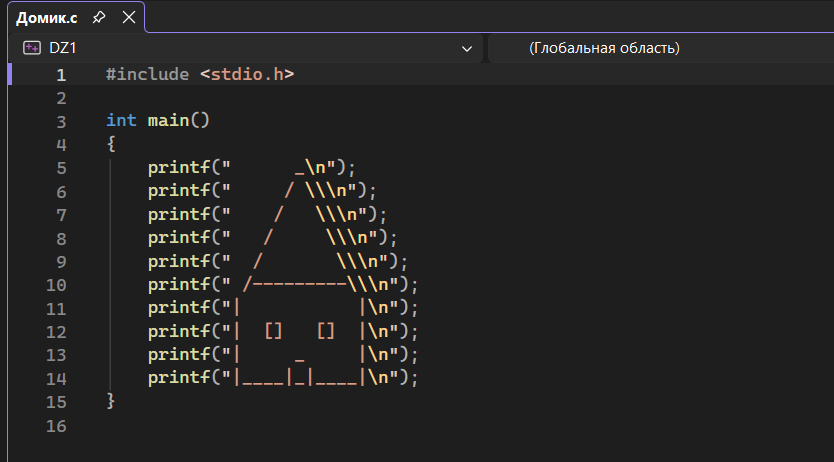
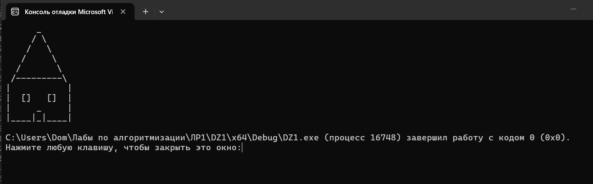

# Домашнее задание к работе 1

## Условия задачи
Напишите программу, которая рисует кораблик с помощью символов.

## 2. Реализация программы

 

## 3. Результаты работы программы

## 4. Информация о разработчике
Орлова Эльвира Эдуардовна
Группа: бИД-261
